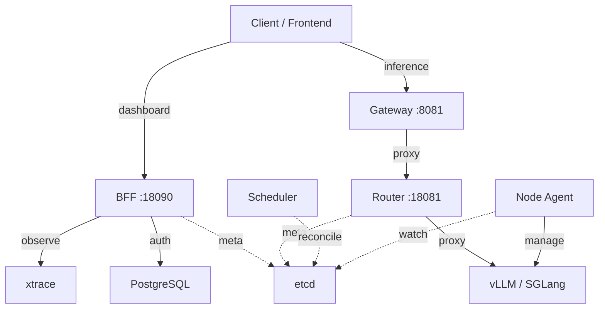
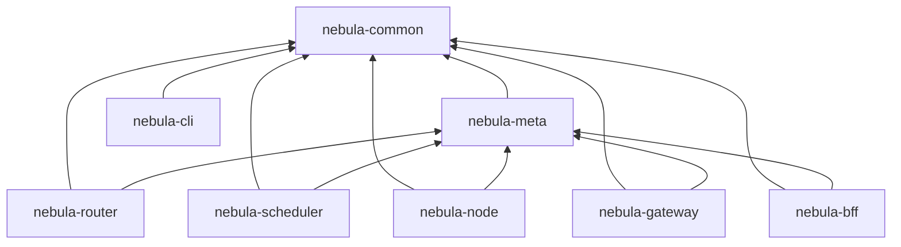

# Nebula 架构

> 权威架构说明（2026-07-13，对齐 **v1.3.0**）。排期与勾选见 [`roadmap.md`](./roadmap.md)；产品阶段见 [`../dev/plan.md`](../dev/plan.md)；HA 见 [`../manual/module.md`](../manual/module.md)、[`report.md`](../dev/ha/report.md)；边界见 [`../dev/ownership.md`](../dev/ownership.md)。

**结论：** 方向不变——etcd 声明式状态、Rust 控制面、外部引擎进程、HTTP Passthrough。M1 / N1 HA 主体 / N2 / 可观测 O1–O8 / **产品对齐 P0–P6 Batch 1** 已随 v1.3.0 落地。真机 Gateway e2e、多引擎 benchmark、多租户压测与生产 etcd 三节点暂缓。剩余按需项（N3/N4/P7）以 [`roadmap.md`](./roadmap.md) 为准。

---

## 1. 背景与动机

Xinference / powerllm 可复用资产在模型与协议侧，负债在控制面：多级 RPC、actor 内存态、引擎嵌入与 monkey-patch。Nebula 的取舍：Rust 控制面 + 外部引擎进程 + etcd 权威状态；放弃「任意 Python 模型对象进程内托管」，长尾模型一律引擎化 / HTTP 化。

相对 xoscar：状态可审计重建、故障域=容器/进程、标准 HTTP/SSE、引擎升级不牵动控制面。跨节点多 rank 不自建协调，按需编排引擎原生分布式。

### 设计原则

- 控制面 / 执行面分离；声明式 + Reconcile；watch + periodic full reconcile 兜底。
- 引擎零侵入；默认 Passthrough；Capability / 兼容矩阵治理选型；EngineShim 按门禁启用。
- 可观测优先：abort/drain 有独立 metrics，不计 5xx 成功率分母；低流量 SLO 不假绿。
- etcd 是唯一权威；本地缓存可丢可重建；对账是「etcd vs runtime」清孤儿，不是双权威同步。
- Gateway = 协议/鉴权/审计/租户准入；Router = 选路+代理；BFF = 控制台；Scheduler 只写期望、不碰 Postgres。

### 相对 PowerLLM：学什么 / 不学什么

**学行为：** fencing 拒旧主写、follower healthz=503、scale-in drain、abort 传播、契约进 CI、镜像族隔离。  
**不学形态：** xoscar/Actor、上帝 Orchestrator、内存权威+事后 rectify、binlog 旧 HA、引擎内嵌/venv subpool、Gateway 吞 Router、core↔API 共享 ORM。

---

## 2. 总体架构

| 组件 | 职责 |
|------|------|
| **Gateway** | OpenAI 兼容 HTTP/SSE；鉴权、租户准入、规范化、错误映射；abort；注入 `x-nebula-model` / ExecutionContext |
| **Router** | endpoint 选择 + 代理；plan_version / stats / 熔断过载 / 重试 |
| **Scheduler** | PlacementPlan CAS；只认 `/deployments/`；兼容/平台过滤；leader election + fencing |
| **MetaStore (etcd)** | 权威元数据（watch / lease / CAS） |
| **Node** | watch placement → 启停引擎 → 注册 endpoint/stats/capabilities；心跳与自愈 |
| **Engine** | vLLM / SGLang 等原生 HTTP 推理进程 |
| **BFF** | 控制台 API：模型、治理、Benchmark、租户/成本 |

默认路径：**Engine-Passthrough**（Gateway → Router → 引擎原生 HTTP）。EngineShim gRPC 为可选增强。

生产元数据默认可单节点 etcd；接入面可多副本（见 HA 文档）。三节点 etcd 能力已旁路验证，生产迁移暂缓。

---

## 3. etcd Keyspace

放置准则与分类（A 应进 / B 节点附属 / C 借住 / D 禁止）见 [`../dev/etcd.md`](../dev/etcd.md)。

| Key | 类型 | 类 | 说明 |
|-----|------|----|------|
| `/nodes/{node_id}/status` | `NodeStatus` | A | 心跳（lease） |
| `/models/{model_uid}/spec` | `ModelSpec` | A | 规格 |
| `/deployments/{model_uid}` | `ModelDeployment` | A | 声明期望（主写：BFF） |
| `/placements/{model_uid}` | `PlacementPlan` | A | CAS；`plan_version` |
| `/endpoints/…` `/stats/…` `/capabilities/…` | 运行时 | A | Node 写（lease） |
| `/images/{id}` | `EngineImage` | A | 镜像注册；Node watch |
| `/image_status/{node}/{id}` | `NodeImageStatus` | A | Node 写（lease） |
| `/compat/` `/slos/` `/canaries/` | 治理 | A | 调度/发布 |
| `/tenants/{id}` | `Tenant` | A | 配额；Gateway 可选读 |
| `/model_gc_requests/{node}/{uid}` | GC 队列 | A | TTL；Node 处理后删 |
| `/nebula/election/…` | 选主 | A | lease + fencing |
| `/model_cache/` `/node_disk/` `/alerts/` | 节点运维 | B | lease |
| `/download_progress/` | 下载进度 | B | 短 TTL |
| `/templates/` | 模板 | C | 借住；宜迁 PG |
| `/pricing/` `/usage/` `/benchmarks/…` | 成本/画像 | C | 借住；宜迁 PG |
| `/model_requests/` | 遗留 | C | 只读；禁止新写 |

约束：placement 全路径 CAS；Router 每模型 `plan_version`；watch 用快照 revision，compact/重连后全量校正。Prometheus **禁止**高基数 `tenant_id` label。

---

## 4. 调度与节点

**扩缩容：** `healthy > desired` 截断 assignment；`<` 增加；`==` 不改（除非 stale）。缩容优先低 pending。平台 / 兼容规则参与候选过滤与可解释拒绝。

**Node：** `(model_uid, replica_id)` 集合差量 reconcile；`periodic_full_reconcile` 推进 Drain；lease 复用；锁外 download/start/health/scrape；恢复预算 + 进程组/Docker restart。

**热路径：** Gateway peek model → `x-nebula-model`；注入 ExecutionContext；Router header 优先 + 字节级 model 改写。

---

## 5. API 与可观测

| 接口 | 状态 |
|------|------|
| `/v1/chat/completions`、`/v1/responses` | ✅ |
| `/v1/embeddings` / `rerank`、`/v1/models` | ✅ |
| BFF `/api/v2/compat|slos|benchmarks|canaries|tenants|pricing` | ✅ |

控制台写路径走 BFF；Gateway `/v1/admin/*` 写接口不扩新双实现（见 [`ownership.md`](../dev/ownership.md)）。

可观测三平面（设计见 [`../manual/module.md`](../manual/module.md)「监控与日志」）：

- **Trace / LLM 语义：** OTLP → xtrace（`init_tracing` + W3C `traceparent`）
- **时序：** Prometheus `/metrics`；热路径与 xtrace **双写**（`DualWriteEmitter`）；租户拒绝仅 `reason=` 低基数标签
- **日志：** `NEBULA_LOG_FORMAT=json` → stdout → Promtail/Vector → Loki（[`../manual/module.md`](../manual/module.md)）

鉴权分离：推理 token（可绑定 tenant）、BFF session、`OBSERVE_TOKEN`。abort/drain 指标不计入 5xx 错误预算。

---

## 6. 里程碑

| 阶段 | 内容 | 状态 |
|------|------|------|
| **M0** | 单机 etcd + gateway/router/node + 引擎 streaming | ✅ |
| **M1** | 多机调度：多副本 + 缩容/Drain + watch + 自愈 + `/stats/` | ✅ |
| **M2** | 声明式单路径；header 热路径 | ✅ |
| **M3** | affinity + prefix/KV 路由深化 | 策略已有，持续打磨 |
| **HA** | Scheduler election；接入多副本真机；旁路 etcd 三节点 | ✅ 主体；生产 etcd 三节点 ⏸ |
| **Obs** | 双写 + JSON/Loki + O8 runbook | ✅ O1–O8；[`../manual/module.md`](../manual/module.md) |
| **Product P0–P6** | 兼容 / SLO / Benchmark / 多租户 Batch 1（Serving Cell 已下线） | ✅ v1.3.0；真机 e2e/压测 ⏸ |

HA 真机报告：[`../dev/ha/report.md`](../dev/ha/report.md)。Release Notes：[`../versions/v1.3.0.md`](../versions/v1.3.0.md)。

---

## 7. Wave 回顾（已关闭）

| Wave | 内容 |
|------|------|
| A–C | 多副本、缩容、Drain、恢复预算、plan_version、deployments、header、lease、锁外 I/O |
| D1/D2 | Scheduler HA、Drain 闭环 |
| D3 主体 | 接入多副本 + Phase D 真机演练（生产 etcd 迁移除外） |
| N2 | BFF 去重、HTTP client、observe、CI |
| P0–P6 Batch 1 | 产品对齐主线（v1.3.0） |

未尽项（真机 e2e、O9、N3、N4、P7、生产 etcd）只在 [`roadmap.md`](./roadmap.md) 维护，本文不另开排期表。

---

## 8. 总评

Nebula 用 etcd + 引擎原生 HTTP 重新分解了 actor 式进程管理问题，架构主轴无需再改。正确性与接入/调度 HA 行为已有真机报告；产品对齐 Batch 1 已发布。生产继续单节点 etcd 即可。具体「下一步做什么」以 [`roadmap.md`](./roadmap.md) 为唯一排期源。
