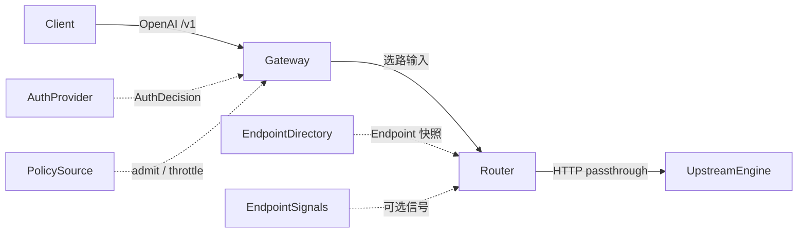

# 控制面无关的推理数据面适配器契约

> **状态：拟议 / 设计（v0）** · 文档先行，**代码未落地**。下文 trait / JSON / 环境变量均为草案，不得当作已实现 API。  
> **读者：** 要把 Nebula Gateway/Router 接到外部发现面或独立运行的研发。  
> **相关：** 组件级实现 [`architecture.md`](./architecture.md)；etcd 边界 [`../dev/etcd.md`](../dev/etcd.md)；上层平台原生契约 [`../dev/integration.md`](../dev/integration.md)；L1 引擎协议契约 [`../dev/contracts.md`](../dev/contracts.md)；热路径性能 [`data-plane-perf-optimization.md`](./data-plane-perf-optimization.md)。

**结论：** 把「谁发现副本、谁做鉴权、谁做配额准入」从 Gateway/Router 热路径里抽成**归一化适配器**。Nebula 默认可独立运行（`CONTROL_PLANE=none`）；PowerLLM / NVIDIA Dynamo / llm-d 都是**可选插件**，禁止把任一平台写进热路径分支。vLLM / SGLang 是 **UpstreamEngine**，不是控制面。

---

## 0. 与极速数据面优化的关系（互补，不互相替代）

| 文档 | 回答的问题 | 不回答的问题 |
|------|------------|--------------|
| [`data-plane-perf-optimization.md`](./data-plane-perf-optimization.md) | 热路径怎么更快：嵌入式 Router、零拷贝流式代理、引擎感知分流 | 控制面从哪来、如何换发现面 |
| **本文** | 控制面如何可插拔：鉴权 / 目录 / 粗粒度策略的归一化契约 | 不规定零拷贝、不改 SSE 帧解析、不把 KV 打分塞进适配器 |

二者正交：

- **热路径性能**：少 hop、少拷贝、少 JSON；观测 span **不**进流式热路径（见性能文档瓶颈 3 与本文 §7）。
- **控制面可插拔**：热路径只消费**已经归一化**的 Endpoint + Auth 判定 + 可选 Policy；目录同步在后台 watch，不阻塞每个 token。

实现顺序上可以并行：先做嵌入式 Router 也不妨碍日后把 `/endpoints/` 换成 `EndpointDirectory`；先做 Dynamo 适配器也不允许在 `proxy_common.rs` 里写 `if dynamo`。

---

## 1. 问题与立场

今天 Nebula 热路径是：

```text
Client → Gateway（鉴权 / 租户准入 / 协议门控）→ Router（选路 + 代理）→ 引擎 HTTP
                    │                              │
                    └─ NEBULA_AUTH_TOKENS / PG key   └─ etcd /endpoints/ + /stats/
```

这套路径**已经完整可独立运行**（见 [`../dev/integration.md`](../dev/integration.md)）。需要可选接入的是**外部控制面 / 发现面**，而不是再造一套引擎：

| 外部系统 | 它实际是什么 | 对 Nebula 的正确位置 |
|----------|--------------|----------------------|
| PowerLLM | 另一套 Python 数据面 + 实例/密钥体系 | 可选 `AuthProvider` / `EndpointDirectory` |
| NVIDIA Dynamo | Frontend + KV/PD Router + **独立发现面** | 可选 `EndpointDirectory`（+ 信号） |
| llm-d | Gateway API / Envoy + EPP（ext-proc） | 可选目录 + 粗粒度 `PolicySource`（准入） |
| vLLM / SGLang | OpenAI `/v1/*` **引擎** | `UpstreamEngine`（目录里的 `base_url`） |
| vLLM production-stack / SGLang Model Gateway | 引擎旁的**路由器 / worker 注册** | 映射为目录 + 角色，而不是第二套热路径 |

**禁止**把 Dynamo Frontend、llm-d EPP、PowerLLM Python 网关或 SGLang Model Gateway **fork 进** `nebula-gateway` / `nebula-router`。

---

## 2. 跨系统对照

对照维度按「谁做入口、谁做发现、谁做选路、鉴权在哪、PD/KV 信号从哪来」展开。表中外部产品行为来自其公开架构，**不是** Nebula 已实现能力。

| 维度 | Nebula（现状，`none`） | NVIDIA Dynamo | llm-d | vLLM + production-stack router | SGLang + Model Gateway |
|------|------------------------|---------------|-------|--------------------------------|------------------------|
| **客户端入口** | Gateway OpenAI `/v1/*`（再转 Router） | Frontend（OpenAI 兼容） | Gateway API / Envoy 代理 | 引擎自身即 OpenAI `/v1/*`；router 挡在引擎前 | 对客户端仍是 OpenAI `/v1`；Gateway 合并 PD 流语义 |
| **选路职责** | Router：`LeastPending` / `least_kv_cache` / `prefix_cache_aware`；熔断、session 亲和 | Router：KV-aware、disagg prefill→decode 选择 | Endpoint Picker（EPP）：Filter → Score → Pick（KV 利用率、前缀亲和、队列、延迟、LoRA） | `roundrobin` / `session` / `prefixaware` / `kvaware` / `disaggregated_prefill*` | `cache_aware` / `power_of_two` 等；PD 时选 prefill/decode worker |
| **发现面** | etcd `/endpoints/`（Node lease 写；Router `list` + `watch`） | **与 Frontend 分离**：etcd **或** K8s CRDs / EndpointSlices / `DynamoWorkerMetadata` | InferencePool = 候选集合；常来自 EndpointSlices | 对引擎做 service discovery；**不是**静态 URL 列表就够 KV-aware | 动态 `POST /workers`（`worker_type`: `prefill` \| `decode` \| `regular`，可选 `bootstrap_port`） |
| **Worker 身份** | `EndpointInfo`：`model_uid` + `replica_id` + `base_url` + `status`（无 PD role 字段） | 按 **model + role**（如 Prefill / Decode）注册 | 池内 endpoint + 标签 / 能力 | 引擎 health/metrics；disagg 角色靠 label（如 `kv_producer` / `kv_consumer`） | worker 带 health 元数据；PD 靠 `worker_type` |
| **鉴权** | Gateway：`NEBULA_AUTH_TOKENS` / 可选 PG API Key / 可选租户配额 | **不是**产品核心面；可挂在 GAIE / 前置网关 | 通常在 Gateway filter，**不在** EPP 内 | 引擎或前置网关；router 侧重发现与策略 | 网关 / 部署侧；引擎仍是 HTTP/gRPC worker |
| **与 K8s Gateway API** | K8s 只作执行面（[`../dev/k8s.md`](../dev/k8s.md)）；不替代 etcd | 可坐在 GAIE 后（Endpoint Picker Plugin），也可走原生 Frontend | 原生：代理与 EPP 经 ext-proc 分离 | 可选，非引擎本体 | 可选，非引擎本体 |
| **KV / 前缀信号** | 可选 `/stats/`：`pending_requests`、`kv_cache_usage`、`prefix_cache_hit_rate`（缺失=`null`） | KV events + 发现面元数据 | EPP 打分输入 | KV-aware **需要外部信号**（如 LMCache controller），静态列表不够 | worker 上的 cache / health 元数据 |
| **流控 / 准入** | Gateway 租户配额 + token RPS；Router 过载 429（候选 KV 全超阈值） | 非核心产品叙事 | **独立阶段**（admission / flow control）与 Pick 分开 | router 策略 + 引擎队列 | Gateway 侧策略 |
| **PD / KV 传输** | 不实现；L2 池角色是 Scheduler 约束（[`pool.md`](./pool.md)） | 引擎间传输（NIXL 等）；Router 只选角色 | 引擎 / 运行时；EPP 只 pick | 引擎 + 可选 disagg 路由 | 引擎间；Gateway 合并流，引擎仍是 worker |
| **对 Nebula 热路径的启示** | 已是归一化消费者：只读 endpoints/stats | 发现面可换；不要内嵌 Dynamo Router | 准入与打分要拆开 | 引擎 = UpstreamEngine | 同样：引擎 ≠ 控制面 |

**读表结论：** 各系统的**入口协议**已经收敛到 OpenAI `/v1`；真正分叉的是**发现面、角色标签、信号来源、准入是否独立**。因此适配器应归一化后三者，而不是再包装一套 chat completions。

---

## 3. 通用性裁决：三个核心适配器

对「Auth / Directory / Policy」三件套逐项验证，并写清**必须 / 可选 / 不要塞什么**。

| 适配器 | 通用性 | 映射 | 热路径约束 |
|--------|--------|------|------------|
| **AuthProvider** | **通用，但可选** | PowerLLM 密钥；Nebula token / PG key；Dynamo/GAIE 前置鉴权；llm-d Gateway filter | `CONTROL_PLANE=none` **不得**要求外置 Auth。集群内互信可 no-op / disabled（仅开发，见 `NEBULA_AUTH_DISABLED`） |
| **EndpointDirectory** | **高度通用 / 核心** | Dynamo 发现；llm-d InferencePool / EndpointSlices；vLLM production-stack 引擎发现；SGLang `/workers`；Nebula etcd `/endpoints/`；PowerLLM 实例注册表 | 必须支持 **list + watch（或带版本的快照）**，禁止只有一次性 PUT |
| **PolicySource** | **部分通用** | PowerLLM 配额 / 限流；llm-d flow-control admission；Nebula 租户配额与 token RPS；粗粒度 router 开关 | **禁止**把 KV-aware / prefix-aware **打分**放进 Policy。打分留在 Router `RoutingStrategy`，吃 `Endpoint` + 可选 `EndpointSignals` |

**为何三件不够、但也不该合成一件「Platform」：** Dynamo 与 llm-d 都把「候选集合」和「怎么挑」分开；SGLang / vLLM 还要 **role + 信号**。合成一个 `ControlPlane` trait 会把 `if dynamo` 重新引进热路径。拆开后，热路径只认三种归一化输入，平台差异关在适配器进程 / 可选 crate 里。

---

## 4. 契约草案（v0）

> 以下为**草图**，落地时再进 `nebula-common`。不得与现状字段**静默冲突**：今日 `EndpointInfo` 继续有效；新字段是超集，由适配器填充，缺省按 §4.4 回退。

### 4.1 热路径只认这三样（加可选信号）

```text
                    后台 reconcile / watch
  AuthProvider ──► AuthDecision ─┐
  EndpointDirectory ──► Endpoint[] ─┼─► Gateway / Router 热路径
  PolicySource ──► PolicyDecision ─┤     （无平台分支）
  EndpointSignals? ──► Signals   ─┘
```



Gateway/Router **零** `if powerllm` / `if dynamo` / `if llm-d`。适配器进程把外部对象译成上述结构；热路径与今天消费 `AuthContext` + `EndpointInfo` + `EndpointStats` 同构。

### 4.2 AuthProvider（可选）

**职责：** 把入站凭证变成允许 / 拒绝 + 身份。不做选路。

| 字段（草案） | 含义 | 现状锚点 |
|--------------|------|----------|
| `allow` | 是否放行 | `auth_middleware` |
| `principal` | 调用方名 | `AuthContext.principal` |
| `role` | `viewer` / `operator` / `admin`（控制 API）；推理面可更粗 | `Role` |
| `tenant_id` | 可选绑定租户 | `AuthContext.tenant_id` |
| `deny_code` | 稳定拒绝码 | C3 / `x-nebula-deny-code` |

`CONTROL_PLANE=none` 的内置实现 = 今日 Gateway：`NEBULA_AUTH_TOKENS`、可选 `platform_api_keys`、`NEBULA_AUTH_DISABLED`（仅开发）。外置适配器（PowerLLM key、GAIE 已鉴权头）**替换或包装**这一层，而不是在 `handlers.rs` 再开分支。

### 4.3 EndpointDirectory（核心）

**职责：** 提供「现在有哪些可路由上游」。必须：

1. **`list` / 快照**：全量候选 + `snapshot_version`（etcd revision、K8s resourceVersion、自增 generation 均可）。
2. **`watch`**：自该版本起的增量（upsert / delete）；流结束后 **全量重同步**（与今日 Router 行为一致）。
3. **不得**假设写者是 Nebula Node：Dynamo worker、llm-d EndpointSlice、SGLang `/workers`、PowerLLM 注册表都通过适配器译入。

`CONTROL_PLANE=none` 的内置实现 = 今日 `endpoints_sync_loop`：`list_prefix_snapshot("/endpoints/")` + `watch_prefix(..., Some(snap_rev))`，compact/重连后全量校正（[`architecture.md`](./architecture.md) §3）。

### 4.4 Endpoint 身份与能力（目录记录的必选超集）

今日 `EndpointInfo`（`crates/nebula-common/src/endpoint.rs`）已有：`model_uid`、`replica_id`、`plan_version`、`node_id`、`endpoint_kind`、`api_flavor`、`status`、`last_heartbeat_ms`、`status_detail`、`grpc_target`、`base_url`。

跨系统对照表明，归一化记录还需要 **role / models / labels / PD hint / ready**。这些是**目录契约的扩展字段**，不是改热路径协议：

| 字段 | 必选 | 说明 |
|------|------|------|
| `id` | 是 | 稳定身份。`none` 模式可合成 `"{model_uid}:{replica_id}"` |
| `base_url` | 是（HTTP 引擎） | 与今日 `EndpointInfo.base_url` 同义；gRPC shim 走 `grpc_target` |
| `models[]` | 是 | 该上游声明可服务的模型名。`none` 模式至少含 `model_uid` 映射后的对外名 |
| `role` | 是 | `unified` \| `prefill` \| `decode`（可扩展）。今日无此字段 → 默认 `unified` |
| `labels` | 是（可空） | 自由键：`node_id`、`engine_type`、`plan_version`、`kv_producer`… |
| `bootstrap` / `transfer` | 否 | PD 引导 / 传输提示（端口、协议名）。**只用于选路元数据**；NIXL/Mooncake 仍在引擎之间 |
| `ready` / `health` | 是 | 与 `EndpointStatus` 对齐：`ready` ≈ `Ready`；其余映射 `starting` / `unhealthy` / `draining` / `failed` |

**归一化 Endpoint JSON 示例（草案，非线上 schema）：**

```json
{
  "id": "qwen3-prod:0",
  "base_url": "http://10.0.1.12:8000",
  "models": ["Qwen/Qwen3-8B"],
  "role": "unified",
  "labels": {
    "node_id": "gpu-node-01",
    "model_uid": "qwen3-prod",
    "replica_id": "0",
    "engine_type": "vllm",
    "plan_version": "3",
    "api_flavor": "openai"
  },
  "bootstrap": null,
  "transfer": null,
  "ready": true,
  "health": "ready"
}
```

PD 示意（字段仍为草案；未启用 PD 时不要出现在 `none` 默认路径）：

```json
{
  "id": "qwen3-prod:prefill:0",
  "base_url": "http://10.0.1.12:8000",
  "models": ["Qwen/Qwen3-8B"],
  "role": "prefill",
  "labels": { "model_uid": "qwen3-prod", "worker_type": "prefill" },
  "bootstrap": { "port": 8998 },
  "transfer": { "protocol": "engine-native" },
  "ready": true,
  "health": "ready"
}
```

### 4.5 EndpointSignals（可选馈送）

**职责：** 给未来 / 现有 Router 策略提供队列、KV、前缀提示。**缺席不得阻塞热路径**（与今日 `EndpointStats` 的 `None` ≠ `0` 相同，见 [`../dev/stats.md`](../dev/stats.md)、契约 C6）。

| 信号（草案） | 现状对应 | 来源举例 |
|--------------|----------|----------|
| `inflight` / `queue_depth` | `pending_requests` | Node scrape；llm-d 队列；SGLang worker 元数据 |
| `kv_util` | `kv_cache_usage` ∈ `[0,1]` 或 `null` | vLLM/SGLang `/metrics`；Dynamo KV events |
| `prefix_hit_rate` | `prefix_cache_hit_rate` | 引擎 metrics |
| `prefix_hash_hints` | **尚无**（性能文档 Phase 3 设想） | production-stack / EPP 前缀亲和 |

适配器可全程 no-op。KV-aware 打分仍在 `nebula-router/src/strategy.rs`，**不**进 `PolicySource`。

### 4.6 PolicySource（粗粒度，部分通用）

**职责：** admit / reject / throttle。输入是身份 + 模型 + 粗成本（如预算 token），输出是策略判定。

| 适合放这里 | 不适合放这里 |
|------------|--------------|
| 配额、RPS、并发上限（今日 `TenantAdmission` + `NEBULA_AUTH_RATE_LIMIT_PER_MINUTE`） | KV 占用打分、前缀 hash 亲和 |
| llm-d 式 **admission / flow-control** 阶段 | EPP Score/Pick 全算法 |
| 「此模型对某租户关闭」类开关 | 引擎内部 batch / LoRA 细调度 |

`CONTROL_PLANE=none`：继续用现有 Gateway 准入；PolicySource 可以是对 `TenantAdmission` 的包装，而不是新服务。

### 4.7 Watch / reconcile 语义（目录必须满足）

各发现面都能塞进同一组语义：

| 语义 | 含义 | 谁已经这么做 |
|------|------|----------------|
| Snapshot + version | `list` 返回全量与版本号 | etcd revision；K8s resourceVersion |
| Incremental watch | upsert / delete；**禁止**只支持全量轮询作为唯一手段（轮询仅作降级） | etcd watch；EndpointSlices watch；Dynamo 发现 watch |
| Resync on gap | compact、断流、版本过期 → 再 `list` | 今日 Router：`watch stream ended, full resync` |
| Lease / ready 过期 | 活副本消失必须从候选集删除 | Node 共享 lease；K8s endpoint 摘除；SGLang worker 注销 |

**一个写者原则不变：** 对某一 `CONTROL_PLANE` 模式，目录的**写入权威**只有一个（Nebula Node、Dynamo discovery、llm-d pool controller、或 PowerLLM 同步器）。禁止 Node 与外部控制器双写同一归一化 `id`（见 [`../dev/ownership.md`](../dev/ownership.md)、[`../dev/etcd.md`](../dev/etcd.md)）。

### 4.8 实现形态（未建 crate）

当前 workspace **没有** `nebula-adapter-*`（成员仅为 gateway / router / scheduler / node / bff / meta / common / control / observe / cli）。落地时：

| 模式 | 建议载体 | 热路径链接方式 |
|------|----------|----------------|
| `none` | 现有 `nebula-common` + `nebula-meta` | 进程内，行为与今日相同 |
| `powerllm` / `dynamo` / `llm-d` | 可选 crate 或 sidecar（如 `nebula-adapter-powerllm`） | 适配器 watch 外部面 → 写入归一化快照（内存或约定前缀）；Gateway/Router 仍只读归一化面 |
| `custom` | 实现同一 v0 trait / HTTP 目录协议 | 同上 |

可选 crate **不得**成为 `nebula-gateway` / `nebula-router` 的必选依赖。

---

## 5. 推荐姿态：`CONTROL_PLANE`

概念模式（落地时环境变量建议 `NEBULA_CONTROL_PLANE`，与现有 `NEBULA_*` 对齐；**今日不存在该变量**）：

```text
CONTROL_PLANE=none|powerllm|dynamo|llm-d|custom
```

| 值 | 含义 | 默认 |
|----|------|------|
| `none` | 今日 Nebula：token / 可选 PG key + etcd（或静态）endpoints + 现有配额 | **是** |
| `powerllm` | 可选适配器对接 PowerLLM 密钥与实例注册 | 否 |
| `dynamo` | 可选适配器对接 Dynamo 发现面（etcd/CRD/EndpointSlice/WorkerMetadata） | 否 |
| `llm-d` | 可选适配器对接 InferencePool / EndpointSlices；准入可走 PolicySource | 否 |
| `custom` | 用户实现同一契约 | 否 |

**默认 `none` 必须零配置兼容现状：** 不设该变量 = 今天的独立集群。打开其他值不得修改 OpenAI 引擎协议，也不得要求 PowerLLM。

**引擎关系：** vLLM / SGLang（及日后 TRT-LLM 等）由 Node 或外部运行时拉起，经目录暴露为 `UpstreamEngine`。它们**不是** `CONTROL_PLANE` 的取值。

```text
CONTROL_PLANE=none          CONTROL_PLANE=dynamo（示意）
┌─────────────┐             ┌──────────────┐
│ Nebula etcd │             │ Dynamo 发现面 │
│ /endpoints/ │             │ / K8s slices │
└──────┬──────┘             └──────┬───────┘
       │  EndpointDirectory        │  nebula-adapter-dynamo
       ▼                           ▼
   归一化 Endpoint[]  ────────►  Router（同一套选路）
                                  │
                                  ▼
                            vLLM / SGLang
```

---

## 6. 与 PowerLLM：互相可选，不是硬依赖

与 [`architecture.md`](./architecture.md)「学行为、不学形态」及 [`../dev/integration.md`](../dev/integration.md)「不提供 PowerLLM 兼容层」一致，本文**不**把 PowerLLM 提升为必选控制面：

| 产品 | 默认数据面 | 对方 |
|------|------------|------|
| PowerLLM | 仍是其 Python 数据面 | Nebula 可选；经适配器对接，而非替换对方内核 |
| Nebula | 仍是独立 Rust Gateway/Router + etcd | PowerLLM 可选；`CONTROL_PLANE=none` 完全不加载 |

因此：

- 不在 Nebula 热路径引入 PowerLLM ORM / Actor / 共享运行时。
- 不要求 PowerLLM 用户改跑 Nebula。
- 集成形态是**双向可选插件**（密钥、实例列表、粗配额），不是「Nebula 内嵌 PowerLLM」或「PowerLLM 内嵌 Nebula Router」。
- [`../dev/integration.md`](../dev/integration.md) 继续描述 **Nebula 原生**推理 / Control API；本文只描述**可选适配器边界**。二者不是同一份兼容层。

---

## 7. 明确非目标

| 非目标 | 原因 |
|--------|------|
| 把 Dynamo / llm-d **fork** 进 Gateway/Router 热路径 | 发现面与选路实现会绑架发布节奏；与「零平台分支」冲突 |
| 把 PowerLLM 做成硬依赖或默认控制面 | 违反独立产品边界；`none` 必须可单独交付 |
| 在流式热路径创建 Langfuse / 逐 token OTel span | 性能文档已指出 SSE 逐帧 JSON 的 ITL 代价；观测走现有 W3C `traceparent` + 抽样 / 双写，不在每个 token 上开 span |
| 在 Nebula 内重实现 vLLM/SGLang 引擎语义 | 默认 **Engine-Passthrough**；协议适配停在 UniGateway 边界（[`../dev/contracts.md`](../dev/contracts.md)） |
| 在 Nebula 内做 KV 传输（NIXL / Mooncake / 引擎 RDMA） | 传输留在引擎之间；目录只带够 PD 选路的 `role` / `bootstrap` / `transfer` 提示 |
| 用 K8s API 替换 etcd 作为 `none` 模式权威 | [`../dev/k8s.md`](../dev/k8s.md)：K8s 是执行面；`dynamo`/`llm-d` 模式由**适配器**读 EndpointSlice，不是 Gateway 直连 kube-apiserver |
| 把 KV-aware 打分写进 `PolicySource` | 对照 llm-d：admission 与 Score/Pick 必须分开 |
| 把 Node 侧 **Engine adapter**（vLLM/SGLang 拉起与 scrape）与本文控制面适配器混名 | 前者已存在于 `crates/nebula-node/src/engine/`；后者是发现/鉴权/策略插件 |

---

## 8. 现状锚点（防止幻觉实现）

下列「今天已经如此」均对照仓库；**没有** `CONTROL_PLANE`、`AuthProvider` trait、`nebula-adapter-*` crate。

| 断言 | 抓手 |
|------|------|
| 热路径 Gateway → Router → 引擎 HTTP | `docs/arch/architecture.md`；`docs/dev/ownership.md` |
| `EndpointInfo` / `EndpointStats` 字段如上 | `crates/nebula-common/src/endpoint.rs` |
| Router 对 `/endpoints/`、`/stats/` 做 snapshot + watch | `crates/nebula-router/src/sync.rs` |
| 选路策略名 | `crates/nebula-router/src/strategy.rs`：`least_pending`、`least_kv_cache`、`prefix_cache_aware` |
| 鉴权环境变量与角色 | `crates/nebula-common/src/auth.rs`；`docs/dev/integration.md` §3 |
| 租户准入与 token RPS | `crates/nebula-common/src/admission.rs`；`NEBULA_AUTH_RATE_LIMIT_PER_MINUTE` |
| 无 `CONTROL_PLANE` / `NEBULA_CONTROL_PLANE` | 全仓库检索无匹配 |
| workspace 无 adapter crate | `crates/*/Cargo.toml` 十个成员，无 `nebula-adapter-*` |
| PowerLLM 非兼容层 | `docs/dev/integration.md` 文首边界；`architecture.md` §1 |
| 引擎 adapter 是 Node 拉起 vLLM/SGLang | `crates/nebula-node/src/engine/`；`reconcile.rs` 日志 `engine adapter selected` |
| L2 池角色 ≠ endpoint role | [`pool.md`](./pool.md) 的 `general`/`prefill`/`decode` 约束 Scheduler，**未**写入 `EndpointInfo` |

---

## 9. 与现有文档怎么读

| 文档 | 关系 |
|------|------|
| [`architecture.md`](./architecture.md) | L0 主轴（etcd、Passthrough）在 `none` 模式下不变；本文是可选外接，不是改主轴 |
| [`data-plane-perf-optimization.md`](./data-plane-perf-optimization.md) | 热路径怎么快；本文是控制面怎么插。Phase 3 KV 亲和消费的是 Signals，不是 Policy |
| [`../dev/integration.md`](../dev/integration.md) | 上层把 Nebula **当作**控制面时的原生 HTTP 契约；不要与「Nebula 去对接 Dynamo」混淆 |
| [`../dev/contracts.md`](../dev/contracts.md) | L1 **引擎协议**一致性（C1–C6）。本文是 **控制面发现/鉴权** 一致性。Router 仍然不做协议翻译 |
| [`../dev/etcd.md`](../dev/etcd.md) / [`../dev/ownership.md`](../dev/ownership.md) | `none` 模式写入口不变；其他模式的写权威在对应适配器一侧 |
| [`pool.md`](./pool.md) / [`vision.md`](./vision.md) | PD 是 L2 放置与引擎原生能力，不是 Gateway 重写 disagg 运行时 |
| [`../dev/k8s.md`](../dev/k8s.md) | EndpointSlice 只通过 `llm-d`/`dynamo` 适配器进入目录，不把 kube 变成第二权威 |

落地若修改归一化字段或增加 crate，须同步本文与 [`../dev/etcd.md`](../dev/etcd.md)（若仍写 etcd）——在实现 PR 里做，不在本设计稿假装已合并。
