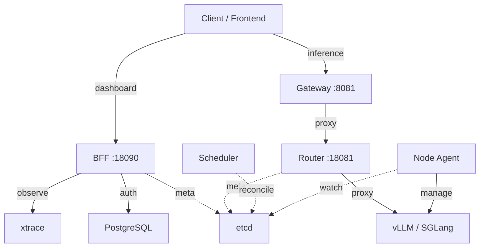
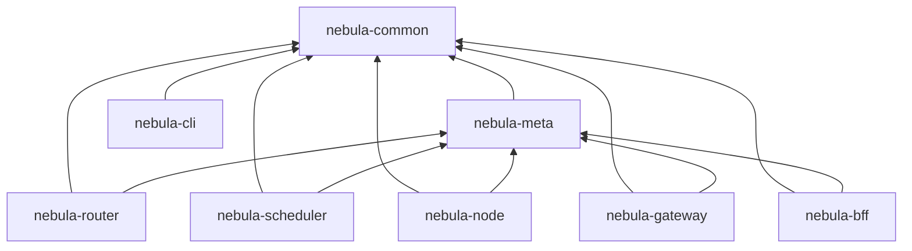

# 历史深度分析（归档）

> **归档说明（2026-07-12）：** 仅保留早期 crate 拓扑示意。现状与排期见 [`architecture.md`](./architecture.md)、[`optimization.md`](./optimization.md)。  
> 已删并并入 arch/dev 短文的文档包括：gpt56-analysis、absorb/checklist、以及大量 `docs/dev` 下归档 stub。

## 组件拓扑（仍有效）

## Crate 依赖（仍有效）

无循环依赖。更细的旧问题清单（BFF 重复、HTTP client 分散等）已迁入 [`optimization.md`](./optimization.md) 的 **N2**，不再在此维护。
