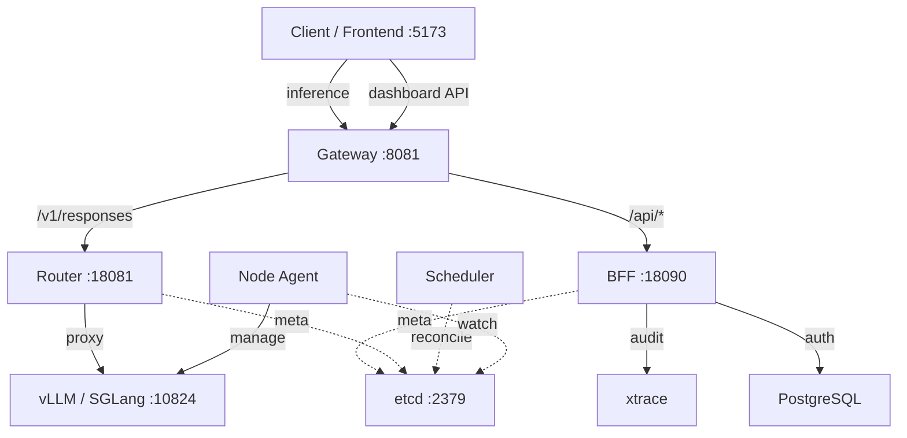
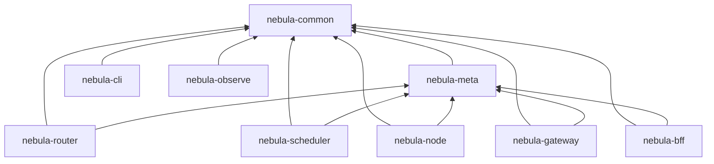

# Nebula 项目架构与代码设计深度分析报告

本报告对 Nebula 项目（基于 Rust 的控制面与多引擎 LLM 服务网格）的整体架构、模块依赖、API 设计、错误处理、数据一致性、可观测性、安全性以及部署基础设施进行深度剖析，并提出系统性的优化建议。

---

## 一、 整体架构概览

Nebula 采用控制面与数据面分离的分布式架构设计：



### 架构评估
- **设计合理性**：Gateway 作为统一入口，Router 负责智能路由与代理解析，Scheduler 执行声明式状态调协，Node Agent 宿主化管理推理引擎，BFF 支撑前端控制台。这一分层理念清晰合理，有助于控制面和执行面的水平扩展。
- **落地差距**：在具体代码实现中，存在边界职责重叠（如 Gateway 与 Router 双重代理）、高并发数据一致性隐患（无 CAS 乐观锁）、可观测性空值化（Dead Code 与 context 丢失）以及大量重复的业务与模板代码，需要进行架构重构与收敛。

---

## 二、 Crate 层级与依赖关系

### 当前依赖拓扑图



> [!NOTE]
> 依赖流向整体健康，无循环依赖。`common` 作为底层通用库，`meta` 抽象元数据访问，各服务组件在其之上构建。

### 发现的问题与优化建议

#### 🔴 问题 1：`nebula-observe` 模块名存实亡
- **现状**：[nebula-observe/src/lib.rs](file:///home/xinference/github/nebula/crates/nebula-observe/src/lib.rs) 仅包含 40 余行代码，只定义了 `ObserveArgs` 结构体，且**没有被任何其他 crate 引用**。各服务各自独立重复定义了与可观测性相关的 CLI 参数。
- **优化**：要么将其充实为共享的可观测性脚手架（统一 metrics 注册、W3C trace context 传播中间件），要么彻底删除，将 `ObserveArgs` 归并到 `nebula-common`。

#### 🟡 问题 2：公共配置碎片化与冗余
- **现状**：每个服务的 `args.rs` 均在重复定义 `--listen-addr`、`--etcd-endpoint`、`--xtrace-url` 等通用 CLI 参数，代码重复率高，环境变动时难以统一维护。
- **优化**：在 `nebula-common` 中声明一个统一的 `CommonArgs` 结构体，各组件服务通过 `#[command(flatten)]` 进行无缝复用。

#### 🟡 问题 3：HTTP Client (`reqwest::Client`) 分散硬编码构造
- **现状**：代码库在以下 5 处独立通过 `reqwest::Client::new()` 及其 builder 构造客户端，且各自拥有硬编码的超时与 TLS 配置：
  - [nebula-gateway/src/main.rs](file:///home/xinference/github/nebula/crates/nebula-gateway/src/main.rs)
  - [nebula-gateway/src/audit.rs](file:///home/xinference/github/nebula/crates/nebula-gateway/src/audit.rs)
  - [nebula-bff/src/main.rs](file:///home/xinference/github/nebula/crates/nebula-bff/src/main.rs)
  - [nebula-node/src/engine/mod.rs](file:///home/xinference/github/nebula/crates/nebula-node/src/engine/mod.rs)
  - [nebula-node/src/engine/sglang.rs](file:///home/xinference/github/nebula/crates/nebula-node/src/engine/sglang.rs)
- **优化**：在 `nebula-common` 提供统一的客户端工厂函数 `fn build_http_client(timeout: Duration) -> reqwest::Client`，集中配置连接池、Keep-Alive 和安全 TLS 设置。

---

## 三、 API 设计与代理机制问题

### 🔴 问题 4：BFF v1/v2 Handler 严重代码重复
- **现状**：这是控制面最严重的技术债。[handlers.rs](file:///home/xinference/github/nebula/crates/nebula-bff/src/handlers.rs) (~940行) 与 [handlers_v2.rs](file:///home/xinference/github/nebula/crates/nebula-bff/src/handlers_v2.rs) (~800行) 中以下 11 对接口的业务逻辑完全一致，仅因 v2 引入了统一响应信封 `{data, code, message}` 而全量复制粘贴了代码：
  - `list_models` / `list_models_v2`
  - `get_model` / `get_model_v2`
  - `deploy_model` / `deploy_model_v2`
  - `delete_model` / `delete_model_v2`
  - `list_deployments` / `list_deployments_v2`
  - `get_deployment` / `get_deployment_v2`
  - `create_deployment` / `create_deployment_v2`
  - `update_deployment` / `update_deployment_v2`
  - `delete_deployment` / `delete_deployment_v2`
- **优化**：解耦 Handler 层与业务逻辑层。引入共享的 `Service` 结构或者在 `nebula-bff` 内通过中间件/泛型 Response 包装器来处理 v2 的信封转换，消除重复的业务逻辑。

### 🔴 问题 5：双代理路径导致职责混乱与架构冲突
- **现状**：目前系统支持两条完全不同的推理代理路径：
  - **路径 A**：`Client` → `Gateway` → 请求 `Router` 的 `/internal/pick` 获取 endpoint 目标地址 → `Gateway` 自己代理请求发送至 `Engine`。
  - **路径 B**：`Client` → `Gateway` → 将请求完整转发给 `Router` 的 `/v1/responses` → `Router` 挑选 endpoint 并执行代理。
- **冲突**：路径 A 使得网关承载了本应属于 Router 的代理与重试逻辑；路径 B 更加符合网关仅做鉴权/审计的原则。双轨并存造成了代码逻辑分裂与难以维护的负载统计。
- **优化**：废弃路径 A。统一收敛为 **路径 B**：`Gateway` 只做流量入口校验、安全隔离与审计，将所有路由决策与代理传输剥离并下沉至 `Router`。

### 🔴 问题 6：Router 在代理时完整缓存请求体
- **现状**：[nebula-router](file:///home/xinference/github/nebula/crates/nebula-router) 的 `proxy_inference` 必须先从 HTTP 请求体中解析出 `model` 名称以确定路由策略，这迫使它在内存中完全 Buffer 整个请求。对于包含超长 Context 或者是多模态（大图、视频输入）的推理请求，这种非流式读取会引发内存暴涨甚至 OOM。
- **优化**：在网关或路由入口支持通过自定义 HTTP Headers（例如 `X-Nebula-Model`）直接传递目标模型，从而允许 Router 直接以 Stream 传输请求体，无需在内存中缓冲。

### 🟡 问题 7：Gateway 职责混杂静态文件服务
- **现状**：Gateway 在 fallback 路径上挂载了静态网页文件服务。作为高性能流量网关，不应分心维护静态 IO 与文件系统生命周期。
- **优化**：生产环境建议通过 Nginx/Caddy 等专用 Web 服务器托管前端资源，在代码中提供 CLI 开关可选择性关闭 Gateway 的内嵌静态服务。

---

## 四、 错误处理与类型系统

### 🔴 问题 8：缺乏统一的领域错误类型与 Handler 样板代码灾难
- **现状**：工作区未定义统一的 Error 枚举。各组件底层函数直接返回 `anyhow::Result`，Handler 层则通过大量重复的模式匹配将错误转换成 HTTP 状态码。例如以下样板代码在 BFF 中重复出现多达 **20 次以上**：
  ```rust
  match meta.get_placement(&uid).await {
      Ok(Some(p)) => { /* success */ }
      Ok(None) => {
          (StatusCode::NOT_FOUND, Json(json!({"error": "not found"}))).into_response()
      }
      Err(e) => {
          tracing::error!(error=%e, "etcd_error", &format!("etcd error: {}", e));
          (StatusCode::INTERNAL_SERVER_ERROR, Json(json!({"error": format!("etcd error: {}", e)}))).into_response()
      }
  }
  ```
- **优化**：利用 `thiserror` 定义全局领域错误枚举 `AppError`（或在各 crate 中定义，在 common 中暴露核心错误分类），并为 `AppError` 实现 Axum 的 `IntoResponse`。让错误传播和日志记录收敛在 `IntoResponse` 内部，简化 Handler 至单行 `?` 传播：
  ```rust
  let placement = meta.get_placement(&uid).await?.ok_or(AppError::NotFound)?;
  ```

### 🟡 问题 9：MetaStore trait 强依赖 `anyhow::Result`
- **现状**：`MetaStore` 方法的签名全部返回 `anyhow::Result`。这掩盖了底层的错误类型，使得调用方无法在不进行字符串匹配的情况下，区分“网络断开连接”、“Etcd 键不存在”与“序列化失败”等不同错误类型。
- **优化**：定义元数据层专属的 `MetaError` 枚举，限制 `anyhow` 的滥用。

---

## 五、 数据一致性与调度机制

### 🔴 问题 10：元数据接口缺乏分页支持
- **现状**：`MetaStore` 的 `list_placements()` 和 `list_deployments()` 均返回全量 `Vec` 数组。当集群规模增大、模型与部署达到成百上千时，每一次轮询与列表展示都将成为严重的性能瓶颈。
- **优化**：为 `list` 系列接口引入 Limit & Offset（或 Cursor-based）的分页参数。

### 🔴 问题 11：更新路径缺乏乐观锁并发控制 (CAS)
- **现状**：虽然 `nebula-meta` 提供了 `compare_and_swap` 接口，但 `nebula-scheduler` 依旧在多处直接调用裸的 `put_placement` / `put_deployment`。在多 Scheduler 运行或高并发变更的场景下，这会引发 Last-Write-Wins 问题，覆盖掉其他节点的并发更新。
- **优化**：强制元数据写路径全部收敛为 CAS 操作。

### 🟡 问题 12：Scheduler 采用粗暴的定时轮询机制
- **现状**：[nebula-scheduler](file:///home/xinference/github/nebula/crates/nebula-scheduler) 采用 `tokio::time::sleep(Duration::from_secs(5))` 配合全量 list 元数据进行 Reconcile。这在高集群规模下会导致大量的 etcd 无效读取，响应也具有延迟。
- **优化**：利用 etcd 现有的 watch 机制，将 Scheduler 改为**事件驱动**，辅以低频（如 1 分钟）的全量 Reconcile 兜底。

### 🟡 问题 13：Router 负载均衡算法逻辑简陋且不具备容错
- **现状**：
  1. `pick_endpoint` 基于最小活跃连接数进行路由选择：
     ```rust
     fn pick_endpoint(endpoints: &[EndpointInfo], stats: &DashMap<String, EndpointStats>) -> Option<EndpointInfo> {
         endpoints.iter()
             .min_by_key(|ep| {
                 stats.get(&ep.id).map(|s| s.active_connections).unwrap_or(0)
             })
             .cloned()
     }
     ```
  2. **致命缺陷**：不判断 endpoint 的健康状态。当某实例死掉（`active_connections` 为 0）时，它反而会持续被选为最优节点。
  3. **指标无状态**：并发指标完全保存在 Router 内存中，重启即丢失，且不支持权重比例调度。
- **优化**：在 Router 内部引入主动/被动健康检查（Passive Outlier Detection / Active Probe），将不健康的节点从路由池中剔除，支持模型实例的权重配置。

### 🟡 问题 14：Scheduler 缺少 Leader Election 机制
- **现状**：为了高可用部署多个 Scheduler 时，它们会由于并发调协同一批 placement 而产生冲突斗争。
- **优化**：基于 etcd 分布式锁或 Lease 机制实现 Leader 选举，确保同一时间只有一个 Active Scheduler。

---

## 六、 安全性设计缺陷

### 🔴 问题 15：Gateway 推理端点完全处于无鉴权状态
- **现状**：目前 BFF 的 JWT 鉴权仅覆盖了 Dashboard API。而 Gateway 暴露的核心推理 API `/v1/responses` 与 `/v1/chat/completions` **完全处于裸奔状态**，外界无需任何凭证即可调用。
- **优化**：在 Gateway 层增加轻量级的 API Key 或者是 Bearer Token 验证拦截器，防止恶意调用泄露 GPU 算力。

### 🟡 问题 16：JWT Secret 硬编码默认值
- **现状**：BFF 的 JWT Secret 在未配置环境变量时，隐式回退到硬编码的默认字符串，对于不小心忽略配置的用户来说是严重的生产安全隐患。
- **优化**：移除硬编码默认值，缺少必要安全环境变量时，程序应当在启动时直接 panic 退出。

### 🟡 问题 17：密码安全与 Auth 进阶缺失
- **现状**：没有 Refresh Token 机制（24小时后用户强制登出），且缺少登录/注册端点的限流保护（容易被暴力破解）。密码哈希兼容了 Argon2 与 Bcrypt 但没有任何迁移路径文档说明。

---

## 七、 可观测性状态

### 🔴 问题 18：缺失分布式链路追踪上下文传递 (Trace Propagation)
- **现状**：虽然各个服务均在 `init_telemetry` 中配置了 OpenTelemetry Tracing，但服务间发送请求时**没有通过 HTTP Headers 传播 W3C `traceparent` 上下文**。这导致 Gateway、Router、Node 与 Engine 的调用日志散落各处，无法在 Jaeger 等后端形成一条完整的链路图。
- **优化**：在跨组件调用（Client -> Gateway -> Router -> Engine）的 HTTP 请求发送与接收拦截器中，引入 `tower-http` 的 trace 传播，注入与提取 trace parent。

### 🟡 问题 19：Prometheus Metrics 从未真正暴露
- **现状**：设计文档中声称支持 Prometheus 指标采集，但代码中没有任何服务组件暴露 `/metrics` 接口，关键系统性能（如路由延迟、TTFT、冷启动耗时、错误率）无法被 Prometheus 抓取。
- **优化**：使用 `metrics` 与 `metrics-exporter-prometheus` 库在各个微服务上架设监控端口。

---

## 八、 部署与容器化问题

### 🟡 问题 20：Dockerfile 缺乏构建缓存优化导致编译效率低下
- **现状**：目前所有的 Dockerfile 均采用简单的 `COPY . .`，这会导致项目里任何非代码文件（如 docs、frontend、readme）的改动都会直接破坏 Docker 的层缓存，每次都需要在容器内从零拉取与编译所有的 Rust 依赖（耗时通常需要数十分钟）。
- **优化**：
  1. 使用 `.dockerignore` 隔离冗余文件。
  2. 引入 `cargo-chef` 机制，在 `COPY` 业务代码前先单独编译 `Cargo.lock` 中的依赖：
     ```dockerfile
     FROM rust:1.82-slim AS planner
     WORKDIR /app
     RUN cargo install cargo-chef
     COPY . .
     RUN cargo chef prepare --recipe-path recipe.json

     FROM rust:1.82-slim AS builder
     WORKDIR /app
     RUN cargo install cargo-chef
     COPY --from=planner /app/recipe.json .
     RUN cargo chef cook --release --recipe-path recipe.json
     COPY . .
     RUN cargo build --release -p nebula-router
     ```

### 🟡 问题 21：docker-compose 与本地脚本运维脆弱
- **现状**：
  1. `docker-compose.yml` 没有任何 `healthcheck` 声明与 `restart_policy`。如果 Etcd 还没初始化完毕，Router 就会因连不上而直接退出且不会自动拉起。
  2. 本地启动脚本 `bin/nebula-up.sh` 硬编码了 `~/bin/etcd`，且没有维护各后台服务的 PID 文件，依靠 `pkill -f` 进行野蛮关闭（容易误杀其他系统进程）。
- **优化**：为 compose 服务增加合理的 `healthcheck`（如 `etcdctl endpoint health`）与 `depends_on: {condition: service_healthy}`。

---

## 九、 改进优先级路线图

我们将上述 22 个优化点进行优先级排序，制定出如下改造方案：

| 优先级 | 优化项目 | 影响领域 | 预估工作量 |
| :---: | :--- | :---: | :---: |
| **P0** | 问题 15：Gateway 推理端点无鉴权 | 安全性 | 小 |
| **P0** | 问题 16：JWT Secret 硬编码默认值 | 安全性 | 极小 |
| **P0** | 问题 4：BFF v1/v2 重复代码清理 | 可维护性 | 中 |
| **P1** | 问题 8：引入统一领域错误类型与 `IntoResponse` | 可维护性 | 中 |
| **P1** | 问题 5：双代理路径收敛至路径 B (Gateway -> Router) | 架构整洁度 | 中 |
| **P1** | 问题 13：Router 端点路由增加健康状态判断 | 可靠性 | 中 |
| **P1** | 问题 18：接入分布式追踪 Trace Propagation | 可观测性 | 小 |
| **P2** | 问题 6：Router 以 Stream 代替 Full Request Buffer | 性能与稳定性 | 中 |
| **P2** | 问题 11：更新路径强制 CAS 乐观锁 | 数据一致性 | 中 |
| **P2** | 问题 20：引入 `cargo-chef` 优化 Dockerfile 构建缓存 | 开发效率 | 小 |
| **P2** | 问题 12：Scheduler 改造为 Etcd Watch 事件驱动 | 性能与响应度 | 中 |
| **P3** | 问题 1、2、3：删除 observe 冗余代码，收敛通用配置与 HTTP 客户端 | 代码整洁度 | 小 |
| **P3** | 问题 10：元数据接口支持分页 | 可扩展性 | 小 |
| **P3** | 问题 14：Scheduler 增加分布式选主 (Leader Election) | 高可用性 | 大 |
| **P3** | 问题 19：补全 `/metrics` 端点 | 可观测性 | 中 |
| **P3** | 问题 21：优化 `docker-compose` 与 PID 运维脚本 | 部署体验 | 小 |

---

## 十、 总结

Nebula 拥有扎实的分布式控制面雏形（Etcd 状态源 + 声明式 Placements），但若要从“MVP”走向“生产就绪”，必须在**安全性（推理端点鉴权）**、**可扩展性（非 Buffer 代理、CAS 与分页）**、**可观测性（Trace 传播与 Metrics）**以及**代码整洁度（v1/v2 业务去重与错误收敛）**这四个方向进行深度重构。建议优先按照 P0 -> P1 -> P2 路线推进。
