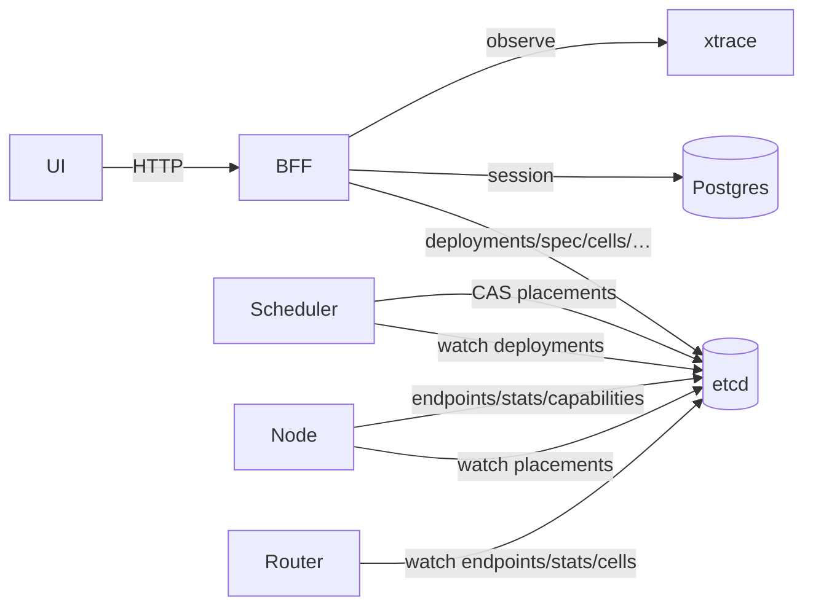

# BFF

边界：[`../api_ownership.md`](../api_ownership.md)。架构：[`../../arch/architecture.md`](../../arch/architecture.md)。

BFF 提供控制台 HTTP API（session、模型、Cell、治理、Benchmark、租户）；**不**替代 Router。推理热路径仍是 Gateway → Router → Engine。

## 数据流

Load：UI → BFF `/api/v2/...` → etcd `/deployments/` + Spec → Scheduler → `/placements/` → Node → `/endpoints/` + `/stats/`。

## API 约定

| 能力 | 路径 |
|------|------|
| 会话 | `/api/auth/*` |
| 声明式模型 | `/api/v2/models/*` |
| Serving Cell | `/api/v2/cells/*` |
| 兼容 / SLO / 诊断 | `/api/v2/compat/*`、`/slos/*`、`/diagnostics/*` |
| Benchmark / Canary | `/api/v2/benchmarks/*`、`/canaries/*` |
| 租户 / 定价 / 成本 | `/api/v2/tenants/*`、`/pricing/*` |
| 观测聚合 | `/api/observe/*`、`/api/audit-logs` |
| 镜像 | `/api/images/*` |

字段级契约以代码为准。控制面写路径为 `/deployments/` + Spec；遗留 `/model_requests/` 仅只读兼容。
