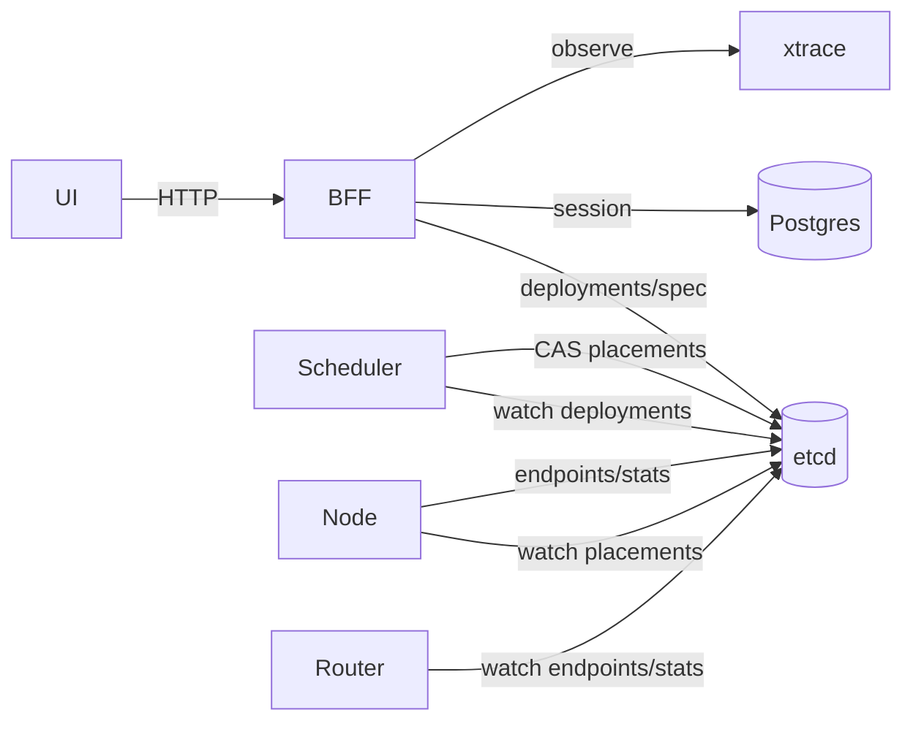

# BFF

边界：[`../api_ownership.md`](../api_ownership.md)。迁移：[`../migrate_deployments.md`](../migrate_deployments.md)。架构：[`../../arch/architecture.md`](../../arch/architecture.md)。

BFF 提供控制台 HTTP API（session、模型管理、观测聚合）；**不**替代 Router。推理热路径仍是 Gateway → Router → Engine。

## 数据流

Load：UI → BFF `/api/v2/...` → etcd `/deployments/` + Spec → Scheduler → `/placements/` → Node → `/endpoints/` + `/stats/`。

## API 约定

| 能力 | 路径 |
|------|------|
| 会话 / SSO | `/api/auth/*` |
| 声明式模型 | `/api/v2/models/*`（写 Deployment/Spec） |
| 观测聚合 | `/api/v2/observability/*` |
| 镜像 | `/api/images/*` 或 `/api/v2/...` |

字段级 OpenAPI 以代码为准；勿再按已废弃的 `/model_requests/` 草案实现客户端。
