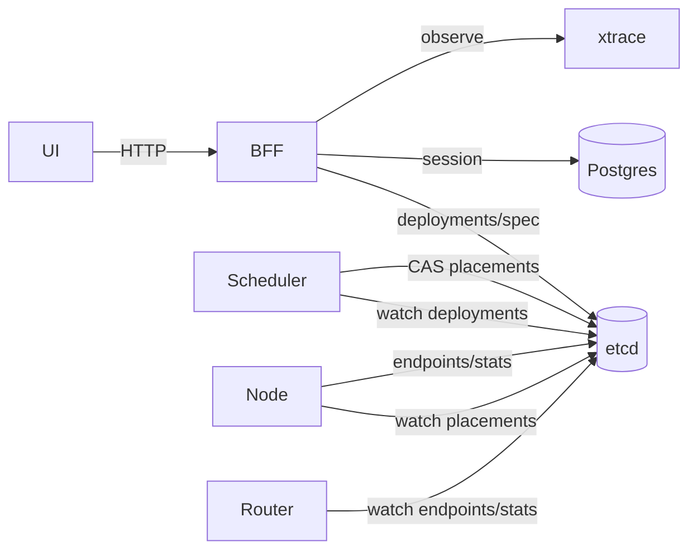

# BFF 架构与数据流

> **已更新（2026-07-11）：** 早期「写 `/model_requests/`、Scheduler 双路 watch」方案已废弃。  
> 权威说明：[`../../arch/architecture.md`](../../arch/architecture.md)；迁移：[`../migrate_deployments.md`](../migrate_deployments.md)；边界：[`../api_ownership.md`](../api_ownership.md)。

## 组件关系

## Load 数据流（当前）

UI/CLI → BFF `POST /api/v2/...` → etcd `/deployments/` + `/models/.../spec` → Scheduler reconcile → `/placements/` → Node 启引擎 → `/endpoints/` + `/stats/`。

BFF 不替代 Router；推理热路径仍是 Gateway → Router → Engine。
